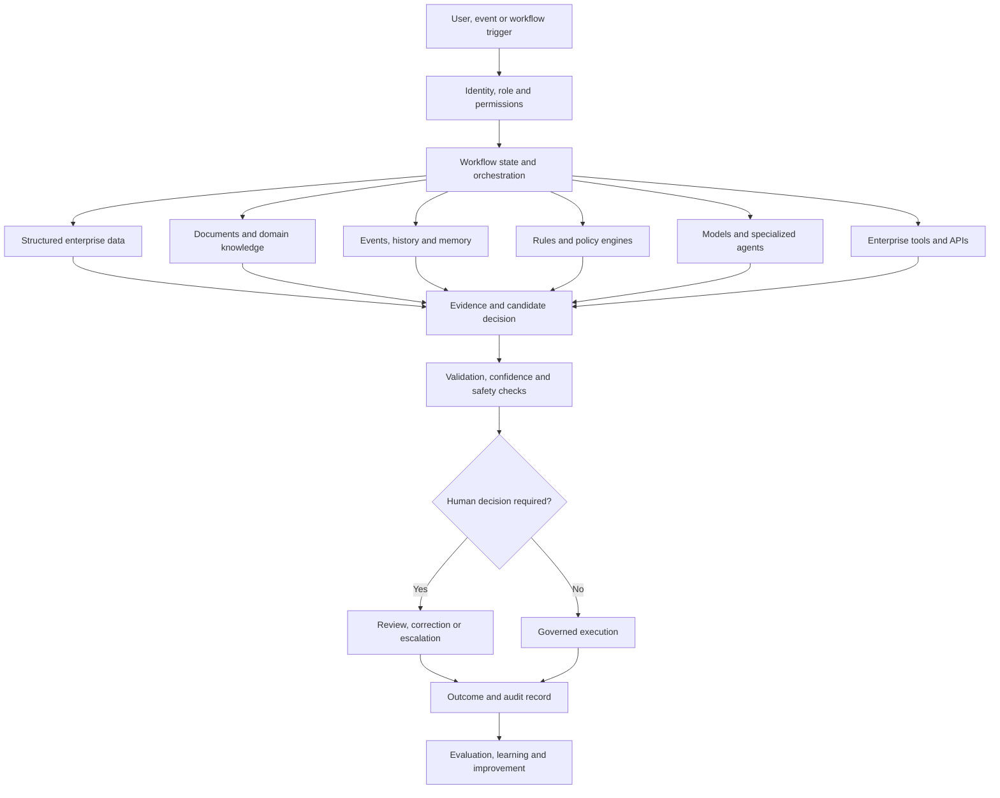

# Enterprise AI Systems Playbook

This playbook describes how I move an AI opportunity from an executive idea or customer problem to a governed, measurable production capability.

## The operating principle

> Start with the decision, workflow, and measurable outcome. Select models and tools only after the operating problem is understood.

A successful enterprise AI system is not a prompt connected to a model. It is a product and operating system built around:

- A clearly defined user and business decision
- Trusted data and domain knowledge
- Models, rules, tools, and workflow orchestration
- Permissions and human accountability
- Evaluation, observability, and auditability
- Adoption, operating ownership, and measurable value

---

## 1. Discover the real workflow

### Understand the decision

The first question is not, "Where can we use generative AI?" The useful questions are:

- What decision or action is difficult today?
- Who makes it?
- What information do they use?
- What information is missing or arrives too late?
- What policies, constraints, and exceptions shape the decision?
- What is the cost of delay, inconsistency, or error?
- What must remain under human control?

### Observe the work

Interviews are useful, but workflows often differ from documented processes. I use:

- User shadowing
- Case and artifact review
- Process and journey mapping
- Exception analysis
- Decision logs
- Tool and data inventories
- Review of historical outcomes
- Prototype-based discovery

### Define the outcome

A use case should connect to one or more measurable outcomes:

- Time saved
- Cycle-time reduction
- Revenue gained or protected
- Cost avoided
- Quality or consistency improvement
- Risk reduction
- User adoption and satisfaction
- Better customer or patient experience
- Increased capacity without linear headcount growth

---

## 2. Select the right automation boundary

Not every workflow should become an autonomous agent.

| Pattern | Appropriate when | Human role |
|---|---|---|
| **Search and summarize** | User needs faster access to trusted information | Reviews and acts on the information |
| **Copilot** | AI can prepare analysis or content, but a person owns the decision | Approves, corrects, or rejects |
| **Workflow agent** | The process has clear tools, states, permissions, and escalation rules | Oversees exceptions and consequential steps |
| **Bounded automation** | Actions are reversible, low-risk, and policy-compliant | Defines policy and monitors outcomes |
| **Autonomous execution** | Environment is highly observable, tested, reversible, and within an accepted risk envelope | Owns policy, monitoring, and emergency intervention |

The appropriate level depends on impact, reversibility, uncertainty, regulatory requirements, and the quality of available evidence.

---

## 3. Design the complete reasoning system



### Separate deterministic and probabilistic components

Use deterministic software for:

- Identity and access control
- Workflow state
- Calculations
- Transaction validation
- Policy and threshold enforcement
- Schema validation
- Audit records
- High-confidence data transformations

Use models for:

- Language understanding and generation
- Semantic retrieval
- Classification with appropriate evaluation
- Extracting structure from complex documents
- Synthesizing evidence
- Generating and testing hypotheses
- Suggesting actions or plans
- Handling natural-language interaction

The system should never ask a model to perform a task that reliable deterministic code can perform more safely.

### Choose the orchestration pattern

- **Linear pipeline:** predictable multi-step processing
- **State machine:** workflows with branches, retries, approvals, and escalation
- **Planner and executor:** useful when tasks require decomposition but should remain bounded
- **Specialized-agent network:** useful when distinct roles, tools, or knowledge domains are required
- **Event-driven workflow:** useful for operational systems, long-running processes, and asynchronous work

---

## 4. Build the knowledge and context layer

### Structured data

Use operational and analytical stores for facts such as customers, claims, matters, incidents, transactions, products, prices, timestamps, and outcomes.

### Retrieval

A robust retrieval system may combine:

- Keyword retrieval
- Vector retrieval
- Metadata filters
- Permission filters
- Query rewriting
- Hybrid ranking
- Cross-encoder or model reranking
- Parent-child or hierarchical document retrieval
- Source freshness and authority weighting

### Knowledge graphs

Graphs are useful when the problem depends on relationships, paths, ownership, dependencies, temporal connections, or blast radius. Examples include:

- Services, APIs, code, deployments, and incidents
- Patients, providers, claims, policies, and authorizations
- Customers, contacts, opportunities, products, and interactions
- Matters, firms, invoices, guidelines, and review outcomes

### Memory

Separate different kinds of memory:

- **Conversation memory:** current interaction context
- **Workflow memory:** state and completed actions
- **User memory:** stable preferences and permissions
- **Case memory:** evidence and decisions for a specific case
- **Organizational memory:** prior cases, corrections, outcomes, and reusable learning

Memory must have retention, deletion, access, and provenance rules.

---

## 5. Prototype for learning, not theatre

A strong prototype should answer four questions:

1. Does the user experience solve a real problem?
2. Can the necessary data and tools be integrated?
3. Can the system produce sufficiently accurate and explainable results?
4. Is there a credible path to measurable value and production controls?

### Prototype scope

A useful prototype usually includes:

- One narrow workflow
- Representative synthetic or authorized data
- A small set of trusted knowledge sources
- One or two important integrations
- Visible evidence and source citations
- A human review step
- A simple evaluation set
- A clear demonstration of business value

Avoid prototypes that hide critical uncertainty or imply production readiness without production controls.

---

## 6. Evaluate the whole system

Model quality is only one dimension.

### Retrieval evaluation

- Recall of relevant evidence
- Precision of retrieved evidence
- Ranking quality
- Source authority and freshness
- Permission correctness
- Citation validity

### Generation and reasoning evaluation

- Factual correctness
- Completeness
- Instruction adherence
- Structured-output validity
- Unsupported-claim rate
- Appropriate uncertainty
- Quality of alternatives and recommendations

### Workflow evaluation

- Correct state transitions
- Correct tool selection and parameters
- Retry and failure handling
- Escalation behavior
- Approval enforcement
- Idempotency and rollback

### Safety and governance evaluation

- Prompt-injection resistance
- Sensitive-data handling
- Access-control enforcement
- Harmful or inappropriate actions
- Bias and fairness risks
- Policy compliance
- Audit completeness

### Business evaluation

- Cycle time
- User effort
- Decision consistency
- Cost per case
- Conversion or recovery
- Error or rework rate
- Adoption and retention
- Customer or user satisfaction

### Evaluation methods

Use a combination of:

- Curated gold datasets
- Historical cases
- Synthetic edge cases
- Automated deterministic checks
- Model-based graders with calibration
- Human expert review
- Online experiments and A/B tests
- Production monitoring and sampled audits

---

## 7. Establish governance as product functionality

Governance should be embedded in the system, not added as a document after development.

### Identity and access

- Single sign-on and role-based access
- Attribute-based policies where needed
- Tenant isolation
- Permission-aware retrieval
- Tool-specific authorization
- Separation of user, agent, and service identities

### Human decision rights

Define explicitly:

- What AI may recommend
- What AI may draft
- What AI may execute
- What requires approval
- Who may approve
- What must always be escalated
- What can be reversed or rolled back

### Auditability

Record:

- User and system identity
- Inputs and retrieved sources
- Model, prompt, workflow, and tool versions
- Intermediate workflow decisions where appropriate
- Generated output and confidence indicators
- Human corrections and approvals
- Actions taken and resulting outcomes

### Privacy and data controls

- Data minimization
- Purpose limitation
- Retention and deletion
- Encryption
- Regional and contractual restrictions
- Redaction and tokenization where appropriate
- No sensitive information in logs or unsafe model endpoints

---

## 8. Design the pilot

A pilot should validate the business and operating model, not only technical feasibility.

### Pilot structure

| Component | Definition |
|---|---|
| Workflow | One bounded use case with a clear start and end |
| Users | Named roles and a manageable cohort |
| Data | Approved sources and representative cases |
| Integrations | Minimum set required to test the workflow |
| Controls | Access, review, logging, escalation, and rollback |
| Evaluation | Baseline, offline tests, and online measures |
| Outcome | Target business and user metrics |
| Duration | Often six to twelve weeks, depending on integration complexity |
| Decision | Scale, revise, stop, or extend based on evidence |

### Pilot success criteria

A good pilot defines thresholds before launch. Examples:

- Reduce average handling time by at least 25 percent
- Achieve expert acceptance of recommendations above an agreed threshold
- Keep unsupported material claims below a defined rate
- Demonstrate complete citation and audit coverage
- Achieve target weekly active usage
- Show a credible financial return at projected production volume

---

## 9. Productize for production

### Platform requirements

- Repeatable deployment and infrastructure as code
- Environment separation
- Secret management
- Model and prompt versioning
- Feature flags and controlled rollout
- Caching and cost optimization
- Rate limits and quotas
- Resilience, fallback, and graceful degradation
- Observability across model, workflow, tool, and business metrics
- Incident response and rollback

### Deployment strategy

- Internal dogfood
- Limited pilot cohort
- Shadow mode
- Human-reviewed recommendations
- Canary release
- Expanded user groups
- Bounded automated actions
- Continued evaluation and audit sampling

### Operating ownership

Production AI requires clear ownership for:

- Product outcomes
- Model and workflow quality
- Data quality
- Security and privacy
- Platform reliability
- Domain policy
- User support and enablement
- Evaluation and change approval

---

## 10. Drive adoption and value realization

AI products change how people make decisions and perform work. Adoption requires more than training.

### Adoption model

- Involve users during discovery and prototype design
- Make evidence and limitations visible
- Reduce friction inside the existing workflow
- Capture corrections without creating extra burden
- Define when users should trust, verify, or escalate
- Provide role-specific enablement
- Measure usage and task completion, not only logins
- Share improvements and resolved issues transparently

### Value realization

Connect product telemetry with business results:

```text
Usage
  -> workflow completion
  -> recommendation acceptance
  -> reduced effort or better decision
  -> operational or financial outcome
```

Avoid claiming value from model activity alone. The value exists only when the workflow outcome improves.

---

## 11. Forward-deployed AI engineering model

Forward-deployed teams operate between product engineering and the customer environment.

### Core responsibilities

- Discover high-value workflows with users and executives
- Build credible prototypes in the customer context
- Integrate data, tools, and domain knowledge
- Translate feedback into reusable product capabilities
- Establish evaluation and governance
- Support pilot adoption and measurable outcomes
- Feed recurring patterns into the core platform roadmap

### Team shape

A typical team may include:

- Forward-deployed AI engineer
- AI solution architect
- Product manager or product owner
- Domain expert
- Data or integration engineer
- UX or conversation designer
- Security and governance partner

The objective is not permanent custom consulting. The objective is to learn rapidly in the field and convert common needs into reusable product, platform, and delivery assets.

---

## 12. Commercialize the solution

### Executive narrative

A strong AI solution story connects:

1. The operational problem
2. The user and decision
3. The AI-enabled workflow
4. The controls and human ownership
5. The measurable outcome
6. The implementation path
7. The expansion opportunity

### Commercial models

Depending on the solution, options include:

- Platform subscription
- Usage-based pricing
- Per-case or per-workflow pricing
- Managed service
- Outcome-aligned pricing
- Implementation and integration services
- Enterprise license with reusable accelerators

### Expansion path

A narrow use case can create broader value by reusing:

- Connectors
- Identity and permissions
- Knowledge and retrieval services
- Workflow orchestration
- Evaluation infrastructure
- Governance controls
- User experience patterns
- Domain-specific agents and tools

---

## Production readiness checklist

### Product

- [ ] Clear user, workflow, and accountable owner
- [ ] Measurable baseline and target outcome
- [ ] Defined failure and escalation experience
- [ ] Adoption and support plan

### Data and knowledge

- [ ] Approved sources and purpose
- [ ] Quality, freshness, lineage, and ownership
- [ ] Permission-aware access
- [ ] Retention and deletion rules

### AI and workflow

- [ ] Versioned models, prompts, tools, and workflows
- [ ] Defined evaluation sets and thresholds
- [ ] Structured outputs and validation
- [ ] Tool and action boundaries
- [ ] Human approvals enforced

### Security and governance

- [ ] Threat model and prompt-injection tests
- [ ] Identity, authorization, and tenant isolation
- [ ] Sensitive-data controls
- [ ] Audit history
- [ ] Incident and rollback procedures

### Operations

- [ ] Monitoring and alerting
- [ ] Cost, latency, and rate controls
- [ ] Fallback and graceful degradation
- [ ] Change and release process
- [ ] Named production owners

### Business

- [ ] Pilot and production economics
- [ ] Value measurement
- [ ] Commercial and support model
- [ ] Expansion roadmap

---

## Closing perspective

Enterprise AI creates durable value when it becomes part of how an organization understands context, makes decisions, executes work, and learns from outcomes.

The winning system is rarely the model alone. It is the complete operating layer around the model, including enterprise state, knowledge, workflow history, permissions, integrations, controls, evaluation, and organizational memory.

## Contact

- [GitHub](https://github.com/amitvikram)
- [LinkedIn](https://www.linkedin.com/in/amit-vik/)
- [Proxiom.ai](https://proxiom.ai)
- [Email](mailto:amitvik@gmail.com)
