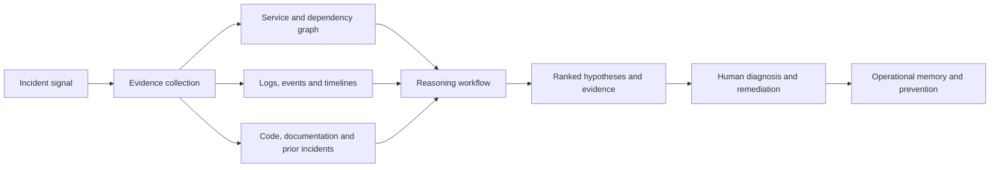
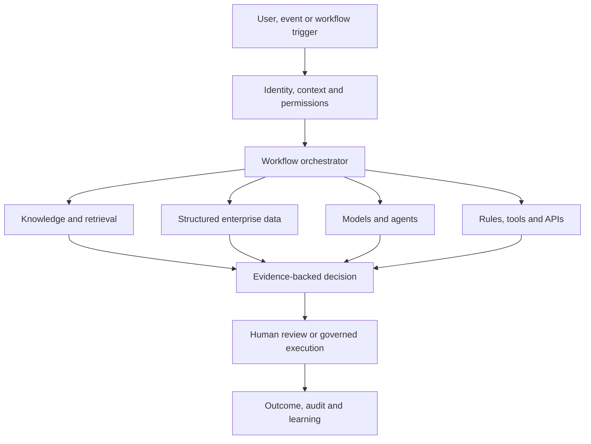
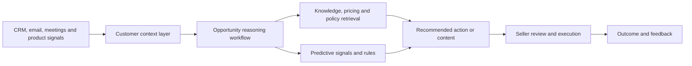

# Product and Solution Portfolio

This portfolio highlights representative enterprise AI products, prototypes, and solution patterns. Public materials use synthetic data, public information, and public-safe architecture descriptions. They do not disclose customer data, protected information, confidential employer assets, or proprietary implementation details.

## Portfolio at a glance

| Solution | Domain | Primary capability | Public artifact |
|---|---|---|---|
| Proxiom Sootro | Technology operations | Incident intelligence and root-cause analysis | [Repository](https://github.com/amitvikram/proxiom-website) |
| Proxiom AI | Enterprise operations | Reasoning and agent operating layer | [Repository](https://github.com/amitvikram/website-Proxiom.ai) |
| Healthcare AI accelerators | Healthcare | Payer, provider, and health-tech workflows | Public-safe prototypes and blueprints in development |
| Legal operations AI | Legal and compliance | Invoice review, analytics, knowledge, and workflow AI | Experience summary only |
| Commercial and GTM AI | Sales and marketing | Seller intelligence, workflow assistance, and decision support | Solution blueprint |

---


## 1. Proxiom Sootro

### AI-powered incident intelligence and troubleshooting

**The problem**

Production incidents span logs, metrics, traces, services, APIs, source code, deployments, configuration, tickets, documentation, and expert knowledge. Engineers reconstruct the evidence manually and often solve problems that the organization has encountered before.

**The solution**

Sootro combines service and dependency graphs, hybrid retrieval, operational evidence, workflow orchestration, and human review to help teams investigate incidents and identify likely causal chains.



**Representative capabilities**

- Incident detection and contextualization
- Blast-radius and dependency analysis
- Code, log, release, and ticket correlation
- Similar-incident retrieval
- Hypothesis generation and evidence ranking
- Diagnostic-step and remediation recommendations
- Human approval for consequential changes
- Outcome capture and recurring-problem prevention

**What it demonstrates**

- Domain-specific reasoning systems
- Knowledge graphs and hybrid retrieval
- Operational data integration
- Explainable root-cause analysis
- AI-assisted, human-owned troubleshooting
- Productization of complex managed-service knowledge

**Commercial relevance**

The same reasoning pattern can extend beyond software incidents into claims denials, quality investigations, customer escalations, supply-chain exceptions, compliance cases, and other complex operational workflows.

**Repository:** [github.com/amitvikram/proxiom-website](https://github.com/amitvikram/proxiom-website)

---

## 2. Proxiom AI

### Enterprise reasoning and agent operating layer

**The problem**

Enterprise knowledge, workflow history, permissions, tools, and decision logic are fragmented across systems. A standalone chatbot may answer questions, but it does not reliably execute governed work inside complex operations.

**The solution**

Proxiom AI is an operating-layer vision that connects models and specialized agents with enterprise context, data, tools, workflow orchestration, human judgment, and auditability.



**Platform capabilities**

- Reusable domain agents
- Model and prompt routing
- Enterprise connectors and tools
- Permission-aware retrieval
- Workflow state and long-term memory
- Human approval and escalation
- Evaluation and observability
- Security, governance, and audit history

**Commercial relevance**

As model prices fall, differentiation moves upward from tokens to products, workflows, proprietary enterprise state, and outcome-based solutions. Proxiom focuses on this enterprise control and execution layer.

**Repository:** [github.com/amitvikram/website-Proxiom.ai](https://github.com/amitvikram/website-Proxiom.ai)

---

## 3. Healthcare AI accelerators

### Payer, provider, and health-tech solution patterns

Healthcare workflows require domain evidence, policy interpretation, structured transactions, privacy controls, and accountable human decisions. Representative accelerators include the following.

### Prior-authorization copilot

- Assemble relevant patient and clinical context from synthetic FHIR-like records
- Retrieve applicable medical-policy requirements
- Extract diagnosis, procedure, medication, and supporting evidence
- Identify missing documentation
- Generate an evidence-linked authorization summary
- Route the recommendation to utilization-management review
- Capture reviewer corrections and audit history

### Claims-denial intelligence

- Ingest synthetic claim, payer, denial, coding, and workflow data
- Categorize denials and detect recurring patterns
- Connect claims with policies, documentation, and prior outcomes
- Identify likely root causes and preventable failure points
- Recommend correction, resubmission, or appeal actions
- Estimate financial recovery opportunity
- Generate a reviewable appeal draft

### Patient reconciliation and care-transition support

- Compare medications, problems, orders, and discharge information
- Highlight inconsistencies and missing follow-up actions
- Retrieve supporting policy and clinical context
- Present evidence and confidence to a qualified reviewer
- Record final decisions and corrections

### Healthcare contact-center intelligence

- Understand member, patient, provider, and case context
- Retrieve approved policies and knowledge
- Suggest responses and next-best actions
- Summarize interactions and update workflows
- Escalate sensitive, ambiguous, or high-risk situations

**Design principles**

- Synthetic or appropriately de-identified demonstration data
- Minimum-necessary access
- Evidence citations and traceability
- Human ownership of clinical and coverage decisions
- Explicit uncertainty and escalation
- Evaluation across accuracy, safety, fairness, workflow impact, and user adoption

---

## 4. Legal operations AI

### Experience pattern

My legal-technology experience includes AI-enabled invoice review, legal analytics, matter and spend-management workflows, document intelligence, natural-language reporting, enterprise search, and managed services.

**Representative solution architecture**

```text
Legal invoice, matter, contract or request
        ↓
Structured extraction and normalization
        ↓
Policy, guideline and historical-pattern retrieval
        ↓
Rules, analytics and model reasoning
        ↓
Evidence-backed recommendation
        ↓
Attorney, reviewer or operations approval
        ↓
Outcome tracking and continuous learning
```

**Business outcomes**

- Improve review consistency and throughput
- Identify policy exceptions and anomalous patterns
- Provide explainable recommendations to reviewers
- Convert managed-service expertise into scalable product capabilities
- Improve visibility into matter, spend, vendor, and workflow performance

---

## 5. Commercial and GTM AI

### Seller and customer intelligence

Commercial teams operate across CRM data, email, meetings, product usage, support interactions, pricing, proposals, and organizational knowledge. AI can augment the workflow by assembling context and recommending timely actions.

**Representative capabilities**

- Zero-entry CRM updates from approved communication sources
- Account, opportunity, and stakeholder summaries
- Meeting preparation and follow-up
- Buying-need and risk detection
- Next-best-action recommendations
- Proposal and content assistance
- Forecast and pipeline intelligence
- Retrieval across product, competition, policy, pricing, and customer history
- Human review before external communication or material CRM changes

**Architecture pattern**



---

## Common production principles

Across all domains, I use the same core principles:

1. Start with the business decision or workflow, not the model.
2. Separate deterministic logic from probabilistic reasoning.
3. Make evidence and uncertainty visible.
4. Use agents inside bounded workflows with explicit tools and permissions.
5. Keep humans accountable for consequential decisions.
6. Evaluate the complete system, not only model responses.
7. Design security, privacy, observability, and auditability from the beginning.
8. Connect technical metrics to workflow and financial outcomes.
9. Capture corrections and outcomes as organizational learning.
10. Build narrow pilots that can evolve into reusable products and platforms.

## Contact

- [GitHub profile](https://github.com/amitvikram)
- [LinkedIn](https://www.linkedin.com/in/amit-vik/)
- [Proxiom.ai](https://proxiom.ai)
- [Email](mailto:amitvik@gmail.com)
