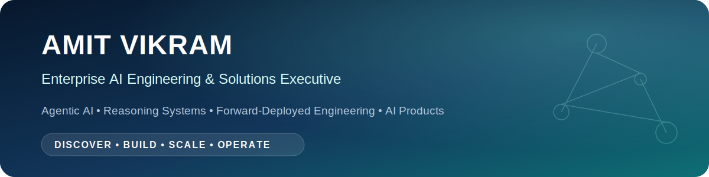
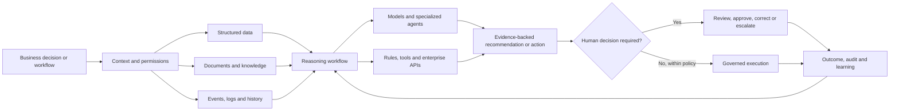

<p align="center">
  
</p>

<p align="center">
  <a href="https://www.linkedin.com/in/amit-vik/"></a>
  <a href="https://proxiom.ai"></a>
  <a href="mailto:amitvik@gmail.com"></a>
</p>

## I build AI systems that move from demonstration to business outcome

I am an enterprise AI engineering, product, and solutions executive with 25+ years of experience building technology platforms, leading global teams, and translating complex operational problems into products that customers can adopt and organizations can scale.

My work sits at the intersection of **engineering, product, consulting, and commercial impact**. I remain hands-on with AI architecture and rapid prototyping while also shaping the customer problem, operating model, implementation roadmap, governance, and value case.

I am the founder of **[Proxiom.ai](https://proxiom.ai)**, focused on enterprise reasoning systems, root-cause analysis, knowledge orchestration, workflow automation, and governed AI deployment.

<table>
<tr>
<td width="25%" valign="top"><strong>BUILD</strong><br/><br/>LLM applications, agents, RAG, knowledge graphs, rapid prototypes, workflow products, evaluation frameworks.</td>
<td width="25%" valign="top"><strong>SELL</strong><br/><br/>Client discovery, executive demonstrations, solution architecture, pilot design, proposals, and value realization.</td>
<td width="25%" valign="top"><strong>SCALE</strong><br/><br/>AI platforms, data foundations, engineering organizations, reusable architecture, governance, and delivery models.</td>
<td width="25%" valign="top"><strong>OPERATE</strong><br/><br/>Security, observability, human oversight, adoption, managed services, reliability, and measurable outcomes.</td>
</tr>
</table>

## Featured builds

| Project | What it demonstrates | Why it matters |
|---|---|---|
| **[Yooti](https://github.com/amitvikram/yooti-cli)** | Governed agentic software delivery using specifications, automated evidence, and five explicit human decision gates | Shows how organizations can use coding agents without surrendering architecture, quality, security, or release accountability |
| **[Synapse](https://github.com/amitvikram/synapse)** | Forward-deployed AI product laboratory with isolated sandboxes, voice and text interaction, persistent memory, live application changes, and GitHub pull requests | Connects customer discovery directly to validated product experiments and engineering artifacts |
| **[Proxiom Sootro](https://github.com/amitvikram/proxiom-website)** | AI-powered incident intelligence combining service graphs, hybrid retrieval, operational evidence, reasoning workflows, and human review | Demonstrates a domain reasoning system for root-cause analysis, remediation support, and operational learning |
| **[Proxiom AI](https://github.com/amitvikram/website-Proxiom.ai)** | Enterprise AI agent marketplace and operating-layer vision spanning knowledge, decisions, workflows, tools, controls, and auditability | Shows how AI moves beyond chat into governed execution inside enterprise operations |

## My enterprise AI architecture pattern



The foundation model is an important component, but rarely the durable enterprise moat. Production value comes from the accumulated system around the model: proprietary context, workflow history, permissions, integrations, evaluation, operating controls, and organizational memory.

## Areas of depth

<p>
  
  
  
  
  
  
  
  
</p>

- **Models and orchestration:** model routing, structured generation, tool use, RAG, multi-agent workflows, LangGraph-style state machines, memory, and human escalation
- **Data and knowledge:** relational data, event streams, vector retrieval, knowledge graphs, semantic layers, quality, lineage, and permission-aware access
- **Platform engineering:** APIs, containers, Kubernetes, CI/CD, model lifecycle, prompt and workflow versioning, observability, evaluation, and cost controls
- **Enterprise integration:** Salesforce, NetSuite, ServiceNow, Jira, enterprise content, cloud services, data platforms, and operational systems
- **Regulated workflows:** privacy, auditability, explainability, access controls, policy enforcement, human accountability, and production risk management

## Leadership experience

- Built and led a global organization of more than 100 professionals across AI engineering, data science, product management, business intelligence, managed services, and technology operations
- Connected data, analytics, AI, applications, and customer operations around shared commercial and operational outcomes for a business with more than $3 billion in revenue
- Built AI-enabled products and workflows across legal operations, sales and marketing, customer operations, enterprise knowledge, incident management, and managed services
- Led at the intersection of product strategy, architecture, customer delivery, adoption, organizational change, and executive stakeholder management
- Earlier career includes a decade of B2B sales and consulting experience across the United States, India, and Japan

## Healthcare and other complex domains

The same architecture principles apply across healthcare, financial services, legal operations, technology operations, and commercial workflows. The domain changes, but the core design problem remains consistent:

> Combine trusted evidence, domain policy, enterprise data, specialized tools, model reasoning, and human judgment around a consequential business decision.

For healthcare, representative patterns include prior authorization, claims-denial intelligence, clinical documentation support, patient reconciliation, contact-center assistance, quality operations, and governed workflow automation. Public demonstrations use synthetic or publicly available data only.

## Explore the portfolio

- **[Product and solution portfolio](PORTFOLIO.md)**, deeper case studies across agentic delivery, forward-deployed engineering, incident intelligence, healthcare, legal operations, and GTM AI
- **[Enterprise AI systems playbook](AI-SYSTEMS-PLAYBOOK.md)**, my approach to discovery, architecture, evaluation, governance, pilots, productionization, and value realization
- **[Proxiom.ai](https://proxiom.ai)**, enterprise AI reasoning and operations platform work

## How I approach client engagements

```text
Discover the decision and measurable outcome
        ↓
Build a narrow, credible prototype
        ↓
Validate with users and domain experts
        ↓
Establish evaluation, security and human controls
        ↓
Pilot inside the real workflow
        ↓
Productize, operate, measure and expand
```

## Connect

I am interested in leadership and advisory opportunities where AI engineering, product strategy, forward-deployed delivery, and customer value come together.

- **LinkedIn:** [linkedin.com/in/amit-vik](https://www.linkedin.com/in/amit-vik/)
- **Email:** [amitvik@gmail.com](mailto:amitvik@gmail.com)
- **Location:** Princeton, New Jersey, United States

<sub>Public repositories and demonstrations are intentionally designed to avoid customer data, protected information, confidential employer assets, production credentials, and proprietary implementation details.</sub>

## Recent AI + ML Projects

A comprehensive public-safe collection of recent enterprise AI and machine-learning work is available in **[Recent AI and ML repository blueprints](portfolio-repositories/README.md)**.

| Use case | Core AI and ML pattern |
|---|---|
| **[Engineering RCA and Troubleshooting](portfolio-repositories/engineering-rca-ai/README.md)** | Graph-based log, code, deployment, and service correlation for evidence-driven root-cause analysis |
| **[Legal Research Automation and RAG Optimization](portfolio-repositories/legal-research-rag-optimizer/README.md)** | Hybrid retrieval, reranking, model selection, citation verification, and legal knowledge graphs |
| **[HCM Employee Onboarding Copilot](portfolio-repositories/employee-onboarding-copilot/README.md)** | Microsoft Teams assistant, permission-aware enterprise RAG, HR and IT workflow orchestration |
| **[Commercial Operations AP: Legal Invoice Review](portfolio-repositories/legal-invoice-review-ai/README.md)** | Legal activity classification, billing rules, anomaly detection, explanations, and reviewer feedback |
| **[Multimodal Search Platform](portfolio-repositories/multimodal-search-platform/README.md)** | CLIP-style contrastive embeddings, vector databases, and cross-modal retrieval |
| **[Dynamic Pricing and Margin Optimization](portfolio-repositories/dynamic-pricing-margin-optimizer/README.md)** | Win-probability modeling, price response, constrained optimization, and approval policy |
| **[Commercial Operations AR Agent](portfolio-repositories/accounts-receivable-ai-agent/README.md)** | Payment prediction, credit-risk scoring, next-best-action prioritization, and communication support |
| **[Agentic Inquiry-to-Quote](portfolio-repositories/inquiry-to-quote-agent/README.md)** | CRM and ERP orchestration, document intelligence, item matching, pricing rules, and human review |
| **[Demand Forecasting and Procurement Automation](portfolio-repositories/demand-forecasting-procurement-ai/README.md)** | Hierarchical probabilistic forecasting, inventory optimization, and procurement recommendations |
| **[Marketing Product Literature Generation](portfolio-repositories/product-literature-generation-ai/README.md)** | Document intelligence, governed RAG, LLM content generation, image generation, and claim verification |
