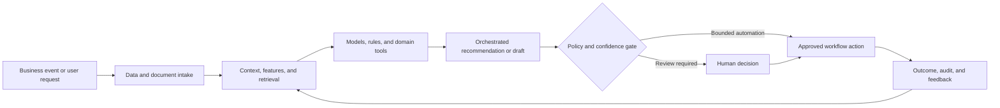

# Commercial Operations AR: Accounts Receivable AI Agent

### Risk-aware collections prioritization using payment prediction, credit scoring, and agentic workflow support

> **Portfolio context:** Built an AI-powered accounts receivable agent using credit-risk scoring and payment-prediction models to prioritize collection actions, reduce manual effort, and improve cash recovery.

This repository is a **public-safe solution architecture and implementation shell**. It documents the product design, data and AI architecture, evaluation approach, operating controls, and pilot path without exposing customer information, proprietary source code, confidential employer assets, or production credentials.

## Executive summary

Collections teams manage large portfolios with limited time and inconsistent prioritization. Aging buckets alone do not capture payment propensity, dispute likelihood, customer value, contact effectiveness, or the best next action.

The proposed system combines domain data, machine learning, retrieval, workflow orchestration, policy controls, and human judgment. The objective is not to automate every decision. The objective is to make the workflow faster, more consistent, evidence-based, measurable, and safe to operate.

## Target users

- Accounts receivable specialists
- Credit and collections managers
- Treasury and finance leaders
- Customer success and account teams
- Dispute-resolution teams

## Business outcomes

- Prioritize accounts and invoices by expected recovery value
- Predict payment timing and default risk
- Recommend the next action and communication channel
- Reduce manual portfolio review
- Improve cash recovery while protecting customer relationships

## End-to-end workflow

1. Ingest invoices, payments, credit, disputes, and contact history
2. Estimate payment probability and expected payment date
3. Score credit and delinquency risk
4. Prioritize actions by expected value and policy constraints
5. Draft customer communication or route workflow actions
6. Capture collector decision and payment outcome

## Reference architecture



## AI and engineering components

- Payment prediction model
- Credit and delinquency risk model
- Dispute detection and classification
- Next-best-action policy
- Communication drafting agent
- CRM and ERP workflow connectors
- Collector review and outcome learning

## API shell

The repository includes a minimal FastAPI contract. It is intentionally thin and does not pretend to contain the confidential production implementation.

```bash
python -m venv .venv
source .venv/bin/activate
pip install -e '.[dev]'
uvicorn src.app:app --reload
pytest
```

Primary demonstration endpoint: `/v1/collections/prioritize`

Example request:

```json
{
  "portfolio_id": "PORT-NA-01",
  "as_of_date": "2026-07-14",
  "max_actions": 50
}
```

Example response contract:

```json
{
  "status": "prioritized",
  "strategy": "expected_recovery_value",
  "action_count": 50
}
```

## Evaluation framework

- Cash collected and recovery rate
- Days sales outstanding
- Promise-to-pay kept rate
- Precision of high-risk identification
- Collector productivity
- Customer escalation and complaint rate

Evaluation must include technical quality, workflow quality, human outcomes, business outcomes, and safety. See [docs/EVALUATION.md](docs/EVALUATION.md).

## Repository structure

```text
.
├── README.md
├── pyproject.toml
├── data/
│   └── synthetic_case.json
├── docs/
│   ├── ARCHITECTURE.md
│   ├── EVALUATION.md
│   ├── GOVERNANCE.md
│   └── PILOT_PLAN.md
├── src/
│   └── app.py
└── tests/
    └── test_contract.py
```

## Production-readiness principles

- Use synthetic or properly authorized data during development.
- Enforce identity, role, tenant, and purpose-based access controls.
- Version data, models, prompts, rules, tools, and evaluation sets.
- Require evidence and traceability for consequential recommendations.
- Define where the system may act, where it must ask, and where it must abstain.
- Monitor drift, latency, cost, failure modes, overrides, and business outcomes.
- Preserve human accountability for high-impact decisions.

## Pilot approach

A historical backtest and shadow-mode prioritization for one collections team, followed by controlled next-best-action recommendations.

## Status

This is a portfolio-grade shell intended for solution discussion, architecture review, and rapid prototyping. The next implementation step is to connect synthetic data and one model or workflow component while preserving the documented evaluation and governance controls.
