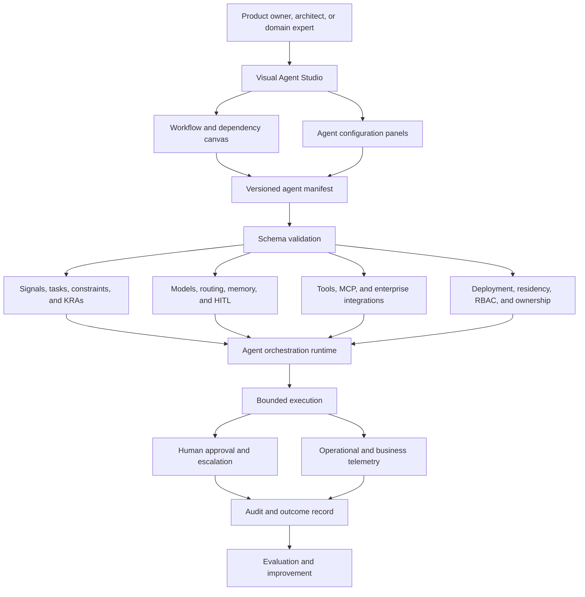
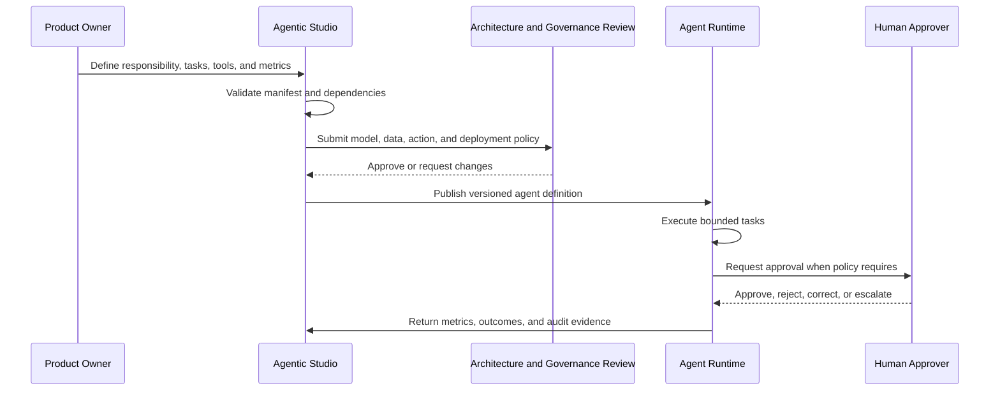

# Agentic Studio

## Visual design and governance platform for enterprise AI agents

> **Portfolio context:** Agentic Studio is a private product codebase. This public-safe page explains the product architecture and operating model without exposing proprietary implementation details, production configuration, credentials, or customer information.

Agentic Studio is a visual, low-code workspace for designing enterprise AI agents as structured, governed, deployable systems.

Rather than defining an agent as a prompt plus a collection of tools, the platform represents the complete operating contract around an agent:

- Business responsibilities and measurable outcomes
- Tasks, dependencies, and failure behavior
- Triggering signals and workflow actions
- Tools, enterprise connectors, and permissions
- Primary, fallback, and task-routed models
- Working, episodic, and semantic memory
- Human review and escalation requirements
- Deployment, data-residency, and ownership policies
- Roles, permissions, visibility, and audit expectations

## The problem

Agent prototypes are easy to create but difficult to scale safely. As the number of agents grows, organizations need a consistent answer to questions such as:

- Who owns this agent?
- What decisions may it make?
- What evidence and tools can it use?
- Which actions require approval?
- What happens when a task fails?
- Which model is used for each task and what is the fallback?
- How much may the workflow cost?
- What memory is retained and for how long?
- Where is the agent deployed?
- Who can view, modify, or execute it?
- Which operational and business metrics determine success?

Agentic Studio converts those concerns into a typed agent manifest and visual workflow.

## Product vision

```text
Business responsibility
        ↓
Visual workflow and agent design
        ↓
Typed, validated agent manifest
        ↓
Model, tool, memory, and policy configuration
        ↓
Human and governance review
        ↓
Versioned deployment artifact
        ↓
Governed runtime, metrics, audit, and learning
```

## Reference architecture



## Core platform layers

### 1. Visual design layer

A web-based visual studio enables teams to inspect and compose agent workflows and dependencies. The current implementation uses Next.js, TypeScript, and React Flow.

### 2. Typed manifest layer

The `agents/v1` manifest acts as the portable definition of an agent. It covers:

- Tasks and dependencies
- Retry, timeout, abort, skip, and human-escalation behavior
- Hard and soft constraints
- Key result areas, targets, and alert thresholds
- Webhook, schedule, manual, and event triggers
- Success, failure, audit, and metric-breach actions
- Tool and integration definitions
- Model providers, fallbacks, budgets, and task routing
- Memory configuration
- Human-in-the-loop policies
- Cloud deployment and autoscaling
- Data residency, ownership, visibility, roles, and permissions

### 3. Tool and integration layer

The architecture supports reusable tool contracts and enterprise connectors. Representative patterns include:

- Model Context Protocol tools
- REST APIs and Python execution
- Salesforce, Jira, Slack, ServiceNow, SAP, and GitHub
- Dataiku and Camunda
- PostgreSQL, Amazon S3, and Azure Blob Storage
- Twilio, Stripe, Square, DocuSign, and HelloSign

### 4. Multi-model control plane

The manifest separates agent logic from a single model vendor. It supports:

- Azure OpenAI
- OpenAI
- Anthropic
- Local models
- Primary and fallback models
- Task-specific routing
- Budget and endpoint controls

### 5. Memory architecture

Memory is divided by purpose:

- **Working memory:** temporary workflow context
- **Episodic memory:** prior cases and interactions
- **Semantic memory:** indexed organizational knowledge

This makes access, retention, and operational policies more explicit.

### 6. Human decision rights

Human review can be required:

- When a task fails
- When an agent explicitly escalates
- When a KRA threshold is breached
- Before every consequential action

### 7. Deployment and access controls

The design includes:

- Azure, AWS, GCP, and local deployment targets
- Regional and data-residency settings
- Resource and autoscaling configuration
- Owning-team metadata
- Public, private, and restricted visibility
- Admin, editor, operator, and viewer roles
- Read, write, delete, and run permissions

## What this product demonstrates

- Low-code and visual agent design
- Agent architecture as code
- Typed configuration and schema validation
- Model routing and provider independence
- MCP-based interoperability
- Enterprise system integration
- Human-in-the-loop governance
- Role-based access and deployment controls
- Business metrics as part of the agent specification
- Product thinking beyond prompt orchestration

## Representative workflow



## Enterprise value

Agentic Studio can help organizations move from disconnected agent experiments toward a reusable operating model by providing:

- Faster agent design and review
- Standardized architecture and governance
- Reusable manifests and tool definitions
- Better separation of business intent and runtime implementation
- Clearer human accountability
- Easier multi-model and multi-cloud deployment
- More consistent auditability and operational ownership
- A pathway from prototype to managed enterprise agent portfolio

## Example use cases

- Employee onboarding and support agents
- Accounts receivable and collection agents
- Inquiry-to-quote automation
- Engineering incident investigation
- Legal and compliance workflows
- Healthcare operations and claims support
- Procurement and supply-chain exception management
- Sales and marketing assistants
- Governed coding and software-delivery agents

## Technology foundation

| Area | Technologies and patterns |
|---|---|
| Application | Next.js 14, React 18, TypeScript |
| Visual design | React Flow |
| Validation | Zod and generated JSON Schema |
| Authentication | NextAuth |
| Metrics | Recharts |
| Tool contracts | Model Context Protocol package |
| Engineering quality | Vitest, Testing Library, ESLint, Prettier, Husky, Commitlint |
| Repository model | TypeScript monorepo with reusable packages |

## Production roadmap

A production-scale implementation would extend the platform with:

- Agent catalog and reusable templates
- Environment promotion and release approvals
- Policy-as-code checks
- Evaluation datasets and regression testing
- Prompt and model version comparison
- Runtime adapters for multiple orchestration engines
- Secret-manager and identity-provider integration
- Cost, latency, quality, and business-value dashboards
- Agent incident management and rollback
- Portfolio-level governance and lifecycle management

## Public-safe boundary

The underlying code repository remains private. This page intentionally excludes:

- Proprietary source code
- Production credentials and endpoints
- Customer or employee information
- Confidential prompts, workflows, and decision policies
- Production infrastructure configuration

Synthetic examples and architecture descriptions are used for portfolio discussion.

## Related portfolio work

- [Yooti](https://github.com/amitvikram/yooti-cli), governed agentic software delivery
- [FDE-Toolkit](https://github.com/amitvikram/synapse), forward-deployed product experimentation
- [Proxiom Sootro](https://github.com/amitvikram/proxiom-website), incident intelligence and reasoning systems
- [Enterprise AI Systems Playbook](../../AI-SYSTEMS-PLAYBOOK.md)

## Status

**Private implementation, public-safe architecture overview available.**

A live walkthrough can demonstrate the visual studio, manifest model, workflow design, tool and model configuration, human controls, and deployment concepts without exposing confidential data.