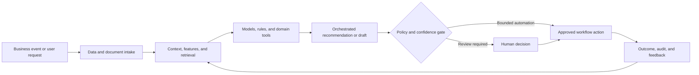

# Commercial Operations Demand Forecasting and Procurement Automation

### End-to-end forecasting, inventory policy, and procurement decision support

> **Portfolio context:** Architected an end-to-end ML demand forecasting and procurement automation pipeline combining revenue prediction with supply and purchasing decisions.

This repository is a **public-safe solution architecture and implementation shell**. It documents the product design, data and AI architecture, evaluation approach, operating controls, and pilot path without exposing customer information, proprietary source code, confidential employer assets, or production credentials.

## Executive summary

Demand planning is affected by seasonality, promotions, product lifecycle, customer concentration, lead times, supplier constraints, and external shocks. Point forecasts alone are insufficient for procurement decisions that must balance service level, inventory, cash, and risk.

The proposed system combines domain data, machine learning, retrieval, workflow orchestration, policy controls, and human judgment. The objective is not to automate every decision. The objective is to make the workflow faster, more consistent, evidence-based, measurable, and safe to operate.

## Target users

- Demand planners
- Procurement and supply-chain teams
- Finance and revenue leaders
- Inventory managers
- Product and commercial teams

## Business outcomes

- Produce hierarchical and probabilistic demand forecasts
- Translate demand uncertainty into inventory and purchase recommendations
- Reduce stockouts, excess inventory, and expedite costs
- Improve forecast accountability and scenario planning

## End-to-end workflow

1. Ingest orders, revenue, inventory, promotions, and external signals
2. Create product, customer, location, and time-series features
3. Generate baseline, ML, and ensemble forecasts
4. Reconcile forecasts across hierarchy levels
5. Estimate uncertainty and scenario ranges
6. Apply inventory, lead-time, and supplier constraints
7. Recommend purchase actions for planner approval

## Reference architecture



## AI and engineering components

- Time-series feature and data-quality pipeline
- Statistical and gradient-boosted forecasting models
- Deep temporal model option
- Hierarchical reconciliation
- Probabilistic forecast and uncertainty service
- Inventory and reorder optimization
- Procurement workflow and planner override

## API shell

The repository includes a minimal FastAPI contract. It is intentionally thin and does not pretend to contain the confidential production implementation.

```bash
python -m venv .venv
source .venv/bin/activate
pip install -e '.[dev]'
uvicorn src.app:app --reload
pytest
```

Primary demonstration endpoint: `/v1/forecast/run`

Example request:

```json
{
  "planning_horizon_weeks": 13,
  "hierarchy": [
    "region",
    "category",
    "sku"
  ],
  "scenario": "base"
}
```

Example response contract:

```json
{
  "status": "forecast_started",
  "outputs": [
    "point_forecast",
    "quantiles",
    "purchase_recommendations"
  ]
}
```

## Evaluation framework

- WAPE, MASE, and bias
- Prediction interval coverage
- Service level and stockout rate
- Inventory turns
- Excess and obsolete inventory
- Planner override and recommendation adoption

Evaluation must include technical quality, workflow quality, human outcomes, business outcomes, and safety. See [docs/EVALUATION.md](docs/EVALUATION.md).

## Repository structure

```text
.
├── README.md
├── pyproject.toml
├── data/
│   └── synthetic_case.json
├── docs/
│   ├── ARCHITECTURE.md
│   ├── EVALUATION.md
│   ├── GOVERNANCE.md
│   └── PILOT_PLAN.md
├── src/
│   └── app.py
└── tests/
    └── test_contract.py
```

## Production-readiness principles

- Use synthetic or properly authorized data during development.
- Enforce identity, role, tenant, and purpose-based access controls.
- Version data, models, prompts, rules, tools, and evaluation sets.
- Require evidence and traceability for consequential recommendations.
- Define where the system may act, where it must ask, and where it must abstain.
- Monitor drift, latency, cost, failure modes, overrides, and business outcomes.
- Preserve human accountability for high-impact decisions.

## Pilot approach

A backtest across multiple demand regimes followed by planner-facing forecasts and procurement recommendations in advisory mode.

## Status

This is a portfolio-grade shell intended for solution discussion, architecture review, and rapid prototyping. The next implementation step is to connect synthetic data and one model or workflow component while preserving the documented evaluation and governance controls.
