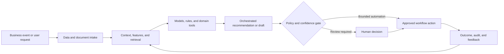

# Dynamic Pricing and Margin Optimization

### Decision intelligence combining win probability, willingness-to-pay signals, and constrained margin optimization

> **Portfolio context:** Designed an ML-driven dynamic pricing system combining win-probability modeling and margin optimization to recommend prices that balance competitiveness with profitability.

This repository is a **public-safe solution architecture and implementation shell**. It documents the product design, data and AI architecture, evaluation approach, operating controls, and pilot path without exposing customer information, proprietary source code, confidential employer assets, or production credentials.

## Executive summary

Commercial teams often price using static discount tables, seller intuition, and limited context. This creates margin leakage, inconsistent customer treatment, slow approvals, and missed opportunities to improve both conversion and profitability.

The proposed system combines domain data, machine learning, retrieval, workflow orchestration, policy controls, and human judgment. The objective is not to automate every decision. The objective is to make the workflow faster, more consistent, evidence-based, measurable, and safe to operate.

## Target users

- Sales representatives
- Deal desk and pricing teams
- Finance and commercial operations
- Product and segment leaders
- Revenue management teams

## Business outcomes

- Recommend a defensible price range for each deal
- Balance expected win probability with contribution margin
- Reduce unnecessary discounting and approval cycles
- Improve pricing consistency while preserving strategic exceptions

## End-to-end workflow

1. Assemble deal, customer, product, competitive, and historical context
2. Estimate win probability across candidate price points
3. Estimate cost, margin, and strategic constraints
4. Optimize expected contribution subject to policy rules
5. Explain recommendation, confidence, and tradeoffs
6. Capture seller action and deal outcome for learning

## Reference architecture



## AI and engineering components

- Feature store for deal and account context
- Win-probability model
- Price-response or elasticity model
- Cost and margin calculation service
- Constrained optimization engine
- Policy and approval rules
- Explanation, monitoring, and outcome feedback

## API shell

The repository includes a minimal FastAPI contract. It is intentionally thin and does not pretend to contain the confidential production implementation.

```bash
python -m venv .venv
source .venv/bin/activate
pip install -e '.[dev]'
uvicorn src.app:app --reload
pytest
```

Primary demonstration endpoint: `/v1/pricing/recommend`

Example request:

```json
{
  "opportunity_id": "OPP-7781",
  "product_bundle": [
    "SKU-101",
    "SKU-205"
  ],
  "quantity": 250
}
```

Example response contract:

```json
{
  "status": "recommendation_ready",
  "objective": "expected_contribution",
  "human_approval_required": true
}
```

## Evaluation framework

- Win-rate lift
- Gross-margin lift
- Discount reduction
- Calibration of win probability
- Recommendation adoption rate
- Revenue and contribution impact

Evaluation must include technical quality, workflow quality, human outcomes, business outcomes, and safety. See [docs/EVALUATION.md](docs/EVALUATION.md).

## Repository structure

```text
.
├── README.md
├── pyproject.toml
├── data/
│   └── synthetic_case.json
├── docs/
│   ├── ARCHITECTURE.md
│   ├── EVALUATION.md
│   ├── GOVERNANCE.md
│   └── PILOT_PLAN.md
├── src/
│   └── app.py
└── tests/
    └── test_contract.py
```

## Production-readiness principles

- Use synthetic or properly authorized data during development.
- Enforce identity, role, tenant, and purpose-based access controls.
- Version data, models, prompts, rules, tools, and evaluation sets.
- Require evidence and traceability for consequential recommendations.
- Define where the system may act, where it must ask, and where it must abstain.
- Monitor drift, latency, cost, failure modes, overrides, and business outcomes.
- Preserve human accountability for high-impact decisions.

## Pilot approach

A retrospective simulation followed by seller-visible recommendations in advisory mode for one segment and product family.

## Status

This is a portfolio-grade shell intended for solution discussion, architecture review, and rapid prototyping. The next implementation step is to connect synthetic data and one model or workflow component while preserving the documented evaluation and governance controls.
