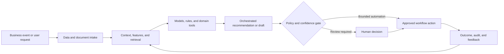

# HCM Employee Onboarding Copilot

### Microsoft Teams-based onboarding assistant for personalized guidance, workflow support, and faster time to productivity

> **Portfolio context:** Built a system for faster employee onboarding and virtual support through an AI assistant embedded in Microsoft Teams.

This repository is a **public-safe solution architecture and implementation shell**. It documents the product design, data and AI architecture, evaluation approach, operating controls, and pilot path without exposing customer information, proprietary source code, confidential employer assets, or production credentials.

## Executive summary

New employees navigate fragmented policies, systems, training, benefits, access requests, team practices, and role expectations. HR and managers repeatedly answer the same questions while employees struggle to identify authoritative and personalized guidance.

The proposed system combines domain data, machine learning, retrieval, workflow orchestration, policy controls, and human judgment. The objective is not to automate every decision. The objective is to make the workflow faster, more consistent, evidence-based, measurable, and safe to operate.

## Target users

- New employees
- Hiring managers
- HR business partners
- IT service teams
- Learning and development teams

## Business outcomes

- Reduce time to productivity
- Increase completion of onboarding milestones
- Deflect repetitive HR and IT questions
- Provide consistent, role-aware, location-aware support
- Surface onboarding friction to HR and business leaders

## End-to-end workflow

1. Receive the employee context and onboarding plan
2. Deliver personalized tasks and reminders in Microsoft Teams
3. Answer policy and process questions using permission-aware retrieval
4. Launch HR, IT, training, and access workflows
5. Escalate sensitive or uncertain requests to the right team
6. Collect feedback and measure onboarding progress

## Reference architecture



## AI and engineering components

- Microsoft Teams bot and adaptive cards
- HRIS and identity integrations
- Permission-aware enterprise search and RAG
- Workflow orchestration for HR and IT actions
- Employee profile and onboarding state store
- Escalation and human handoff
- Analytics and feedback loop

## API shell

The repository includes a minimal FastAPI contract. It is intentionally thin and does not pretend to contain the confidential production implementation.

```bash
python -m venv .venv
source .venv/bin/activate
pip install -e '.[dev]'
uvicorn src.app:app --reload
pytest
```

Primary demonstration endpoint: `/v1/onboarding/assist`

Example request:

```json
{
  "employee_id": "E-10027",
  "message": "How do I request access to the pricing analytics workspace?",
  "channel": "microsoft-teams"
}
```

Example response contract:

```json
{
  "status": "guidance_ready",
  "action_type": "access_request",
  "human_review_required": false
}
```

## Evaluation framework

- Time to productivity
- Onboarding task completion rate
- Question deflection rate
- First-contact resolution
- Escalation accuracy
- Employee satisfaction and confidence

Evaluation must include technical quality, workflow quality, human outcomes, business outcomes, and safety. See [docs/EVALUATION.md](docs/EVALUATION.md).

## Repository structure

```text
.
├── README.md
├── pyproject.toml
├── data/
│   └── synthetic_case.json
├── docs/
│   ├── ARCHITECTURE.md
│   ├── EVALUATION.md
│   ├── GOVERNANCE.md
│   └── PILOT_PLAN.md
├── src/
│   └── app.py
└── tests/
    └── test_contract.py
```

## Production-readiness principles

- Use synthetic or properly authorized data during development.
- Enforce identity, role, tenant, and purpose-based access controls.
- Version data, models, prompts, rules, tools, and evaluation sets.
- Require evidence and traceability for consequential recommendations.
- Define where the system may act, where it must ask, and where it must abstain.
- Monitor drift, latency, cost, failure modes, overrides, and business outcomes.
- Preserve human accountability for high-impact decisions.

## Pilot approach

A 6 week pilot for one job family and location, integrating Teams, a synthetic HRIS profile, onboarding content, and two workflow actions.

## Status

This is a portfolio-grade shell intended for solution discussion, architecture review, and rapid prototyping. The next implementation step is to connect synthetic data and one model or workflow component while preserving the documented evaluation and governance controls.
