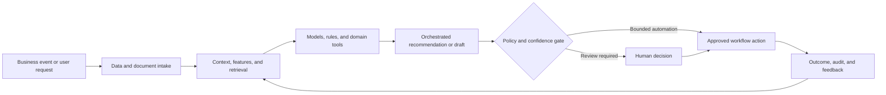

# Engineering RCA and Troubleshooting Intelligence

### Graph-based log, code, change, and service correlation for evidence-driven incident diagnosis

> **Portfolio context:** Developed a product for log analysis and log-code correlation using graph networks, enabling incident root-cause analysis and faster resolution.

This repository is a **public-safe solution architecture and implementation shell**. It documents the product design, data and AI architecture, evaluation approach, operating controls, and pilot path without exposing customer information, proprietary source code, confidential employer assets, or production credentials.

## Executive summary

Production incidents span logs, traces, metrics, code, deployments, service dependencies, tickets, runbooks, and prior incidents. Engineers lose time reconstructing timelines and testing hypotheses across disconnected tools.

The proposed system combines domain data, machine learning, retrieval, workflow orchestration, policy controls, and human judgment. The objective is not to automate every decision. The objective is to make the workflow faster, more consistent, evidence-based, measurable, and safe to operate.

## Target users

- Site reliability engineers
- Application engineers
- Platform and cloud operations
- Incident commanders
- Engineering leaders

## Business outcomes

- Reduce mean time to diagnose and resolve incidents
- Improve consistency and auditability of investigations
- Reuse learning from prior incidents and remediation actions
- Identify recurring and preventable failure patterns

## End-to-end workflow

1. Ingest incident signals and normalize evidence
2. Build service, code, deployment, and ownership context
3. Retrieve similar incidents, logs, code regions, and runbooks
4. Generate and rank causal hypotheses with supporting evidence
5. Recommend diagnostic tests and bounded remediation options
6. Capture human decisions, outcomes, and prevention actions

## Reference architecture



## AI and engineering components

- Log and event parsers
- Service dependency and code knowledge graph
- Hybrid keyword and vector retrieval
- Temporal event correlation
- Graph neural network or graph-ranking layer
- LLM reasoning workflow with tool use
- Human approval, audit, and feedback loop

## API shell

The repository includes a minimal FastAPI contract. It is intentionally thin and does not pretend to contain the confidential production implementation.

```bash
python -m venv .venv
source .venv/bin/activate
pip install -e '.[dev]'
uvicorn src.app:app --reload
pytest
```

Primary demonstration endpoint: `/v1/incidents/analyze`

Example request:

```json
{
  "incident_id": "INC-1042",
  "symptoms": [
    "checkout latency spike",
    "HTTP 503 increase"
  ],
  "time_window_minutes": 30
}
```

Example response contract:

```json
{
  "status": "analysis_queued",
  "incident_id": "INC-1042",
  "evidence_required": [
    "logs",
    "deployments",
    "service_graph"
  ]
}
```

## Evaluation framework

- Top-k root-cause recall
- Mean reciprocal rank of correct hypothesis
- Evidence citation precision
- Time to first useful hypothesis
- MTTD and MTTR improvement
- Human override and escalation rate

Evaluation must include technical quality, workflow quality, human outcomes, business outcomes, and safety. See [docs/EVALUATION.md](docs/EVALUATION.md).

## Repository structure

```text
.
├── README.md
├── pyproject.toml
├── data/
│   └── synthetic_case.json
├── docs/
│   ├── ARCHITECTURE.md
│   ├── EVALUATION.md
│   ├── GOVERNANCE.md
│   └── PILOT_PLAN.md
├── src/
│   └── app.py
└── tests/
    └── test_contract.py
```

## Production-readiness principles

- Use synthetic or properly authorized data during development.
- Enforce identity, role, tenant, and purpose-based access controls.
- Version data, models, prompts, rules, tools, and evaluation sets.
- Require evidence and traceability for consequential recommendations.
- Define where the system may act, where it must ask, and where it must abstain.
- Monitor drift, latency, cost, failure modes, overrides, and business outcomes.
- Preserve human accountability for high-impact decisions.

## Pilot approach

A 6 to 8 week pilot on two services and a curated set of historical incidents, followed by shadow-mode support for live incidents.

## Status

This is a portfolio-grade shell intended for solution discussion, architecture review, and rapid prototyping. The next implementation step is to connect synthetic data and one model or workflow component while preserving the documented evaluation and governance controls.
