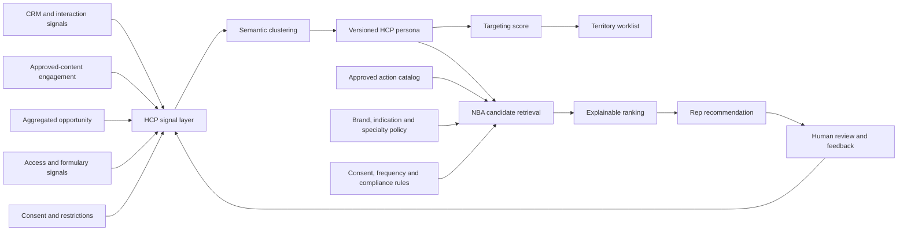

# HCP Targeting and Next-Best-Action Platform

## Product problem

Pharmaceutical field teams often receive disconnected targeting scores, CRM histories, content suggestions and campaign priorities. A representative still has to determine:

1. Which HCP should I prioritize today?
2. Why is that HCP important now?
3. What action is useful, permitted and supported by evidence?
4. Which approved content and channel should I use?
5. When should I pause, refer a question to Medical, or trigger a safety workflow?

This product turns those disconnected signals into a governed decision-support workflow for HCP prioritization and next-best action.

## Product experience

A field representative opens a territory worklist and sees HCPs ranked into priority tiers. Selecting an HCP shows:

- Target score and the strongest score drivers
- A natural-language persona built from professional engagement history
- Demonstrated evidence interests and access barriers
- Ranked next-best actions
- The evidence supporting each recommendation
- Approved content identifiers
- Channel consent and frequency-cap checks
- Medical and pharmacovigilance routing controls
- A human decision workflow to accept, dismiss, complete or defer

## Architecture



## Targeting model

The MVP combines professional and aggregated signals rather than patient-level identifiers:

| Signal | Illustrative weight |
|---|---:|
| Aggregated patient opportunity | 25% |
| Clinical relevance | 20% |
| Engagement propensity | 15% |
| HCP access | 10% |
| Professional influence | 8% |
| Relationship strength | 8% |
| Data freshness | 7% |
| Persona clarity and fit | 7% |

Recent contact pressure and negative engagement reduce the score. Do-not-contact, inactive and compliance-hold profiles are excluded from promotional targeting.

## Next-best-action model

The engine evaluates only eligible actions from an approved catalog. Ranking combines:

- Semantic relevance to the HCP persona
- Recent engagement context
- Specialty, brand and indication fit
- Preferred and consented channel
- Timeliness of the latest signal
- Commercial priority
- Contact fatigue
- Prior representative decisions

Example actions include:

- Schedule an outcomes-focused discussion
- Send an approved email
- Share an approved access resource
- Invite the HCP to an approved peer program
- Refer an unsolicited scientific question to Medical
- Escalate a potential adverse event or product complaint
- Pause outreach when contact pressure is high or evidence is weak

## Governance by design

The system is designed as decision support, not autonomous promotional execution.

- Promotional content actions require an approved content ID
- Brand, indication and specialty scope are enforced
- Only consented channels are eligible
- Contact-frequency controls suppress repetitive actions
- Do-not-contact and compliance-hold restrictions block outreach
- Unsolicited scientific questions route to Medical
- Safety and product-quality signals route to the required internal workflow
- Recommendations include evidence and guardrails
- Representatives review every action before execution
- The demonstration uses synthetic HCP data

A production implementation would integrate with CRM, consent master, MLR and digital-asset management, identity and access management, pharmacovigilance, adverse-event reporting, data lineage, audit retention and country-specific promotional policies.

## MVP implementation

- FastAPI service
- HCP profile and signal APIs
- Semantic persona generation
- Territory targeting and priority tiers
- Approved action catalog
- Explainable NBA ranking
- SQLite persistence for the local demonstration
- Rep feedback and frequency-cap learning
- Browser dashboard
- Synthetic cardiology, endocrinology and oncology scenarios
- Automated targeting, API, compliance and safety tests
- GitHub Actions CI

## Evaluation framework

The product should be evaluated across four layers:

### Recommendation quality

- Representative acceptance rate
- Top-k relevance
- Persona correction rate
- Repetition and fatigue rate

### Commercial value

- Time saved in call planning
- Incremental HCP engagement
- Approved-content utilization
- Movement in appropriate downstream business measures

### Governance

- Consent compliance
- Frequency-cap compliance
- Approved-content compliance
- Medical-referral accuracy
- Safety-escalation recall and timeliness

### Product adoption

- Weekly active representatives
- Recommendation review rate
- Accept, dismiss and defer patterns
- Territory-manager usage
- Reasons for override

## Production evolution

```text
CRM and content events: Kafka, Kinesis or managed integration platform
Operational data: Postgres, warehouse and feature store
Semantic retrieval: pgvector, OpenSearch or managed vector database
Policy services: consent, MLR, country rules and contact governance
Model lifecycle: registry, monitoring, drift, evaluation and release controls
Experimentation: randomized tests, uplift analysis and causal measurement
Workflow: Salesforce or Veeva embedded experience with audit trail
```

## What this project demonstrates

This product shows how a general persona-based recommendation platform can become a regulated, domain-specific commercial application by combining semantic reasoning with explicit policy, approved content, explainability, human accountability and operational feedback.
