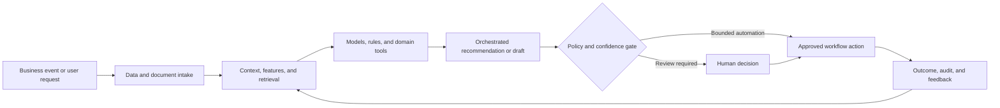

# Commercial Operations Quote: Agentic Inquiry-to-Quote System

### CRM, ERP, product matching, and pricing orchestration for fast and consistent quote generation

> **Portfolio context:** Developed an agentic AI inquiry-to-quote system integrating CRM, ERP, and item matching to automate customer quote generation, reduce response time, and enforce consistent tier-based pricing.

This repository is a **public-safe solution architecture and implementation shell**. It documents the product design, data and AI architecture, evaluation approach, operating controls, and pilot path without exposing customer information, proprietary source code, confidential employer assets, or production credentials.

## Executive summary

Customer inquiries arrive through email, portals, documents, and conversations with incomplete product details. Sellers manually identify items, confirm availability, apply account pricing, resolve ambiguity, and generate quotes across disconnected systems.

The proposed system combines domain data, machine learning, retrieval, workflow orchestration, policy controls, and human judgment. The objective is not to automate every decision. The objective is to make the workflow faster, more consistent, evidence-based, measurable, and safe to operate.

## Target users

- Inside sales and customer service
- Account executives
- Deal desk and pricing teams
- Sales operations
- Product and order-management teams

## Business outcomes

- Reduce inquiry-to-quote cycle time
- Improve item matching and quote completeness
- Enforce account, tier, and policy-based pricing
- Reduce manual rekeying across CRM and ERP
- Escalate ambiguity instead of silently generating incorrect quotes

## End-to-end workflow

1. Ingest and classify the customer inquiry
2. Extract products, quantities, requirements, and delivery constraints
3. Match requested items to catalog and alternatives
4. Retrieve account terms, inventory, lead time, and pricing policies
5. Generate a structured quote and explanation
6. Route exceptions for human approval
7. Write approved quote and activity back to CRM and ERP

## Reference architecture



## AI and engineering components

- Email and document intelligence
- Product and item matching model
- Catalog and substitution knowledge graph
- CRM and ERP tool connectors
- Tier-based pricing and approval engine
- Quote generation agent
- Human review, audit, and customer communication

## API shell

The repository includes a minimal FastAPI contract. It is intentionally thin and does not pretend to contain the confidential production implementation.

```bash
python -m venv .venv
source .venv/bin/activate
pip install -e '.[dev]'
uvicorn src.app:app --reload
pytest
```

Primary demonstration endpoint: `/v1/quotes/generate`

Example request:

```json
{
  "inquiry_id": "INQ-4419",
  "account_id": "ACC-208",
  "source": "email"
}
```

Example response contract:

```json
{
  "status": "draft_created",
  "requires_review": true,
  "exceptions": [
    "one ambiguous item match"
  ]
}
```

## Evaluation framework

- Inquiry-to-quote time
- Item-match top-1 and top-3 accuracy
- Quote accuracy and completeness
- Exception and approval rate
- Seller effort reduction
- Quote conversion and margin

Evaluation must include technical quality, workflow quality, human outcomes, business outcomes, and safety. See [docs/EVALUATION.md](docs/EVALUATION.md).

## Repository structure

```text
.
├── README.md
├── pyproject.toml
├── data/
│   └── synthetic_case.json
├── docs/
│   ├── ARCHITECTURE.md
│   ├── EVALUATION.md
│   ├── GOVERNANCE.md
│   └── PILOT_PLAN.md
├── src/
│   └── app.py
└── tests/
    └── test_contract.py
```

## Production-readiness principles

- Use synthetic or properly authorized data during development.
- Enforce identity, role, tenant, and purpose-based access controls.
- Version data, models, prompts, rules, tools, and evaluation sets.
- Require evidence and traceability for consequential recommendations.
- Define where the system may act, where it must ask, and where it must abstain.
- Monitor drift, latency, cost, failure modes, overrides, and business outcomes.
- Preserve human accountability for high-impact decisions.

## Pilot approach

A limited catalog and customer-tier pilot using historical inquiries, synthetic ERP data, and human review before quote release.

## Status

This is a portfolio-grade shell intended for solution discussion, architecture review, and rapid prototyping. The next implementation step is to connect synthetic data and one model or workflow component while preserving the documented evaluation and governance controls.
