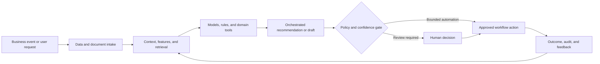

# Commercial Operations AP: AI-Powered Legal Invoice Review

### Scalable legal invoice review using billing rules, anomaly detection, matter context, and human approval

> **Portfolio context:** Built and scaled an AI-powered legal invoice review system to more than 50 enterprise customers.

This repository is a **public-safe solution architecture and implementation shell**. It documents the product design, data and AI architecture, evaluation approach, operating controls, and pilot path without exposing customer information, proprietary source code, confidential employer assets, or production credentials.

## Executive summary

Legal invoices contain large volumes of narrative line items, inconsistent coding, complex billing guidelines, and matter-specific exceptions. Manual review is expensive, inconsistent, and difficult to scale while preserving defensibility and law-firm relationships.

The proposed system combines domain data, machine learning, retrieval, workflow orchestration, policy controls, and human judgment. The objective is not to automate every decision. The objective is to make the workflow faster, more consistent, evidence-based, measurable, and safe to operate.

## Target users

- Corporate legal departments
- Legal operations teams
- Accounts payable teams
- Outside counsel management
- Invoice reviewers and auditors

## Business outcomes

- Identify guideline violations and questionable charges
- Standardize review decisions across matters and reviewers
- Reduce review effort while preserving human accountability
- Increase savings, compliance, and spend visibility
- Provide explainable findings to internal teams and law firms

## End-to-end workflow

1. Ingest invoice, matter, timekeeper, and guideline data
2. Normalize line items and classify legal activity
3. Apply deterministic billing rules and policy checks
4. Score anomalies and compare with peer patterns
5. Generate evidence-backed adjustment recommendations
6. Route exceptions to human reviewers
7. Capture reviewer decisions and continuously improve models

## Reference architecture



## AI and engineering components

- Invoice and narrative document intelligence
- Legal activity and task classification
- Billing-rule engine
- Anomaly and outlier detection
- Matter and timekeeper peer models
- Explanation and evidence service
- Human review workflow and audit trail

## API shell

The repository includes a minimal FastAPI contract. It is intentionally thin and does not pretend to contain the confidential production implementation.

```bash
python -m venv .venv
source .venv/bin/activate
pip install -e '.[dev]'
uvicorn src.app:app --reload
pytest
```

Primary demonstration endpoint: `/v1/invoices/review`

Example request:

```json
{
  "invoice_id": "INV-88214",
  "matter_id": "MAT-2041",
  "currency": "USD"
}
```

Example response contract:

```json
{
  "status": "review_queued",
  "review_layers": [
    "rules",
    "classification",
    "anomaly",
    "explanation"
  ]
}
```

## Evaluation framework

- Precision and recall of review findings
- Recommended versus accepted adjustment rate
- False-positive burden
- Review time per invoice
- Savings and compliance lift
- Reviewer consistency and override rate

Evaluation must include technical quality, workflow quality, human outcomes, business outcomes, and safety. See [docs/EVALUATION.md](docs/EVALUATION.md).

## Repository structure

```text
.
├── README.md
├── pyproject.toml
├── data/
│   └── synthetic_case.json
├── docs/
│   ├── ARCHITECTURE.md
│   ├── EVALUATION.md
│   ├── GOVERNANCE.md
│   └── PILOT_PLAN.md
├── src/
│   └── app.py
└── tests/
    └── test_contract.py
```

## Production-readiness principles

- Use synthetic or properly authorized data during development.
- Enforce identity, role, tenant, and purpose-based access controls.
- Version data, models, prompts, rules, tools, and evaluation sets.
- Require evidence and traceability for consequential recommendations.
- Define where the system may act, where it must ask, and where it must abstain.
- Monitor drift, latency, cost, failure modes, overrides, and business outcomes.
- Preserve human accountability for high-impact decisions.

## Pilot approach

A retrospective benchmark on de-identified invoices followed by shadow-mode review and controlled reviewer adoption.

## Status

This is a portfolio-grade shell intended for solution discussion, architecture review, and rapid prototyping. The next implementation step is to connect synthetic data and one model or workflow component while preserving the documented evaluation and governance controls.
