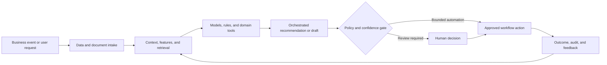

# Legal Research Automation and RAG Optimization

### Evidence-grounded legal research using tuned retrieval, model routing, and knowledge graph context

> **Portfolio context:** Improved performance and reduced hallucination in a RAG-based legal research application through parameter tuning, model selection, and knowledge graph capabilities.

This repository is a **public-safe solution architecture and implementation shell**. It documents the product design, data and AI architecture, evaluation approach, operating controls, and pilot path without exposing customer information, proprietary source code, confidential employer assets, or production credentials.

## Executive summary

Legal research systems must retrieve the right authority, preserve jurisdiction and temporal context, distinguish holdings from commentary, and produce answers that can be verified. Generic RAG often fails through weak chunking, incomplete retrieval, citation drift, and unsupported synthesis.

The proposed system combines domain data, machine learning, retrieval, workflow orchestration, policy controls, and human judgment. The objective is not to automate every decision. The objective is to make the workflow faster, more consistent, evidence-based, measurable, and safe to operate.

## Target users

- Attorneys and legal researchers
- Legal operations teams
- Knowledge management teams
- Compliance professionals
- Product and AI governance teams

## Business outcomes

- Increase retrieval recall without overwhelming the model
- Reduce unsupported claims and citation errors
- Improve jurisdiction, authority, and temporal filtering
- Create repeatable evaluation for retrieval and answer quality

## End-to-end workflow

1. Parse legal documents into structure-aware units
2. Enrich authorities, citations, courts, topics, and dates
3. Index text with hybrid sparse and dense retrieval
4. Traverse citation and authority relationships in a knowledge graph
5. Route queries by complexity and research intent
6. Generate an evidence-backed answer with pinpoint citations
7. Evaluate retrieval, faithfulness, completeness, and abstention

## Reference architecture



## AI and engineering components

- Document intelligence and legal structure parser
- BM25 plus dense vector retrieval
- Cross-encoder reranking
- Legal citation and authority knowledge graph
- Query decomposition and routing
- Model selection and prompt policy
- Citation verification and groundedness evaluator

## API shell

The repository includes a minimal FastAPI contract. It is intentionally thin and does not pretend to contain the confidential production implementation.

```bash
python -m venv .venv
source .venv/bin/activate
pip install -e '.[dev]'
uvicorn src.app:app --reload
pytest
```

Primary demonstration endpoint: `/v1/research/query`

Example request:

```json
{
  "question": "What standards govern preliminary injunctions in a federal trade-secret dispute?",
  "jurisdiction": "US-Federal",
  "as_of_date": "2026-07-01"
}
```

Example response contract:

```json
{
  "status": "research_started",
  "retrieval_mode": "hybrid_graph",
  "requires_citations": true
}
```

## Evaluation framework

- Recall@k and nDCG@k
- Citation precision and citation completeness
- Answer faithfulness
- Unsupported-claim rate
- Abstention quality
- Latency and cost per research task

Evaluation must include technical quality, workflow quality, human outcomes, business outcomes, and safety. See [docs/EVALUATION.md](docs/EVALUATION.md).

## Repository structure

```text
.
├── README.md
├── pyproject.toml
├── data/
│   └── synthetic_case.json
├── docs/
│   ├── ARCHITECTURE.md
│   ├── EVALUATION.md
│   ├── GOVERNANCE.md
│   └── PILOT_PLAN.md
├── src/
│   └── app.py
└── tests/
    └── test_contract.py
```

## Production-readiness principles

- Use synthetic or properly authorized data during development.
- Enforce identity, role, tenant, and purpose-based access controls.
- Version data, models, prompts, rules, tools, and evaluation sets.
- Require evidence and traceability for consequential recommendations.
- Define where the system may act, where it must ask, and where it must abstain.
- Monitor drift, latency, cost, failure modes, overrides, and business outcomes.
- Preserve human accountability for high-impact decisions.

## Pilot approach

A benchmark-driven pilot using a curated legal corpus and attorney-authored questions, with blind evaluation against a baseline RAG system.

## Status

This is a portfolio-grade shell intended for solution discussion, architecture review, and rapid prototyping. The next implementation step is to connect synthetic data and one model or workflow component while preserving the documented evaluation and governance controls.
