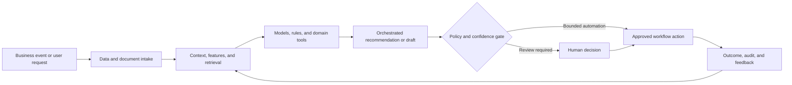

# Multimodal and Representational Learning Search Platform

### Cross-modal text and image retrieval using contrastive vision-language embeddings and vector search

> **Portfolio context:** Designed a product for combined text and image search using contrastive vision-language models and vector databases to enable semantic alignment across media types.

This repository is a **public-safe solution architecture and implementation shell**. It documents the product design, data and AI architecture, evaluation approach, operating controls, and pilot path without exposing customer information, proprietary source code, confidential employer assets, or production credentials.

## Executive summary

Traditional search treats text and images as separate modalities. Users cannot easily search an image catalog with natural language, find related text from an image, or discover semantically similar media when metadata is incomplete.

The proposed system combines domain data, machine learning, retrieval, workflow orchestration, policy controls, and human judgment. The objective is not to automate every decision. The objective is to make the workflow faster, more consistent, evidence-based, measurable, and safe to operate.

## Target users

- Digital asset managers
- E-commerce and merchandising teams
- Marketing and creative teams
- Product and design researchers
- Media and knowledge-management teams

## Business outcomes

- Enable text-to-image, image-to-image, and image-to-text retrieval
- Reduce dependence on manual tagging
- Improve discovery across large media libraries
- Create reusable multimodal representations for downstream applications

## End-to-end workflow

1. Ingest images, captions, documents, and metadata
2. Generate normalized text and image embeddings
3. Store vectors with access-control and metadata filters
4. Run cross-modal nearest-neighbor retrieval
5. Rerank using metadata, quality, and business constraints
6. Collect relevance feedback and improve representation quality

## Reference architecture



## AI and engineering components

- CLIP or equivalent contrastive encoder
- Image preprocessing and quality service
- Text normalization and query expansion
- Vector database and approximate nearest-neighbor index
- Cross-modal reranker
- Metadata and access filters
- Relevance evaluation and feedback capture

## API shell

The repository includes a minimal FastAPI contract. It is intentionally thin and does not pretend to contain the confidential production implementation.

```bash
python -m venv .venv
source .venv/bin/activate
pip install -e '.[dev]'
uvicorn src.app:app --reload
pytest
```

Primary demonstration endpoint: `/v1/search/multimodal`

Example request:

```json
{
  "query_text": "industrial pump in a clean manufacturing facility",
  "top_k": 12,
  "filters": {
    "license": "approved"
  }
}
```

Example response contract:

```json
{
  "status": "complete",
  "retrieval_mode": "text_to_image",
  "result_count": 12
}
```

## Evaluation framework

- Recall@k and precision@k
- Mean reciprocal rank
- Cross-modal alignment score
- Human relevance rating
- Diversity and duplicate rate
- Index latency and cost

Evaluation must include technical quality, workflow quality, human outcomes, business outcomes, and safety. See [docs/EVALUATION.md](docs/EVALUATION.md).

## Repository structure

```text
.
├── README.md
├── pyproject.toml
├── data/
│   └── synthetic_case.json
├── docs/
│   ├── ARCHITECTURE.md
│   ├── EVALUATION.md
│   ├── GOVERNANCE.md
│   └── PILOT_PLAN.md
├── src/
│   └── app.py
└── tests/
    └── test_contract.py
```

## Production-readiness principles

- Use synthetic or properly authorized data during development.
- Enforce identity, role, tenant, and purpose-based access controls.
- Version data, models, prompts, rules, tools, and evaluation sets.
- Require evidence and traceability for consequential recommendations.
- Define where the system may act, where it must ask, and where it must abstain.
- Monitor drift, latency, cost, failure modes, overrides, and business outcomes.
- Preserve human accountability for high-impact decisions.

## Pilot approach

A curated catalog pilot with text-to-image and image-to-image tasks, relevance judgments, and a baseline metadata search comparison.

## Status

This is a portfolio-grade shell intended for solution discussion, architecture review, and rapid prototyping. The next implementation step is to connect synthetic data and one model or workflow component while preserving the documented evaluation and governance controls.
