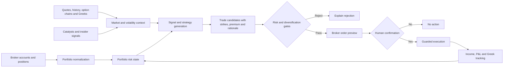

# Options Income and Portfolio Risk System

### A consistency-first decision and execution platform for multi-broker options portfolios

> **Portfolio context:** Built a broker-neutral options trading system that integrates Tastytrade and Tradier, evaluates the existing portfolio before recommending new trades, tracks income goals and Greeks, and enforces defined risk, diversification, and execution controls.

This page is a **public-safe solution architecture and product overview**. The working implementation is maintained privately because it connects to brokerage accounts and contains account-specific risk settings, credentials, and trading configuration.

## Executive summary

Premium selling is often treated as a collection of isolated trades. The larger problem is portfolio management: deciding whether another trade is needed, understanding how it changes delta and theta, avoiding hidden concentration, adapting to different market regimes, and refusing weak trades when a daily income target creates pressure to overtrade.

The system treats options income as a governed portfolio workflow. It combines broker data, market data, signal generation, strategy construction, risk validation, human confirmation, execution controls, and performance tracking.

## Product principles

- Consistency before maximum premium
- No naked calls
- Cash-secured puts only on an explicit ownership-quality allowlist
- Defined-risk spreads when assignment would create excessive exposure
- Daily premium goals as planning inputs, not trading mandates
- Diversification across sectors and correlated instruments
- Separate income capital from speculative long-stock and LEAP ideas
- Broker preview and human confirmation before live execution

## Target users

- Active options traders managing multiple brokerage accounts
- Investors using covered calls and cash-secured puts for income
- Portfolio managers seeking repeatable risk and diversification controls
- Traders who want decision support without fully autonomous execution

## Core capabilities

### Broker integration

- Tastytrade accounts, balances, positions, transactions, IV metrics, order previews, and execution
- Tradier accounts, balances, positions, quotes, history, option chains, Greeks, order previews, and execution
- Combined portfolio view across connected accounts

### Portfolio intelligence

- Net liquidation, cash, and buying power
- Position-level and portfolio-level delta and theta
- Exposure by underlying, sector, and correlation group
- Same-account verification for covered calls and cash-secured puts
- Daily, monthly, and annual income goals versus actual results

### Market and strategy scanner

The scanner evaluates:

- Buy the dip
- Buy on strength
- Fade the surge
- Sideways and range-bound conditions
- Upcoming earnings and other catalysts
- Recent open-market insider purchases
- Implied-volatility rank and percentile
- Option liquidity and bid-ask width
- Market regime and sector momentum

It can construct:

- Covered calls
- Cash-secured puts
- Bull put spreads
- Bear call spreads
- Iron condors
- Calendars
- Diagonals
- Long stock and LEAP candidates in a separate speculative sleeve

## End-to-end workflow

## Recommendation output

Each candidate includes:

- Strategy and signal category
- Expiration and exact option legs
- Limit credit or debit
- Premium received or capital required
- Maximum risk and return on risk
- Estimated delta and theta impact
- Probability proxy based on short-option delta
- Market, sector, catalyst, and portfolio rationale
- Passed checks, warnings, and rejection reasons

## Risk controls

- Naked short calls are rejected
- Covered calls require verified shares in the execution account
- Cash-secured puts require both sufficient account cash and an approved underlying
- Defined-risk trades are checked against a maximum loss threshold
- Projected exposure is checked by underlying, sector, and correlated group
- Projected portfolio delta is checked against net liquidation
- Poor-liquidity contracts are excluded
- Live trading is disabled by default
- Execution requires a current recommendation, local validation, broker preview, and exact confirmation text

## Market-regime resilience

The system detects broad bull, bear, sideways, and mixed conditions, then changes ranking rather than relying on one permanent strategy.

| Regime | Preferred behavior |
|---|---|
| Bull | Bull put spreads, selective CSPs, covered calls above cost basis, momentum-aligned diagonals |
| Bear | Bear call spreads, smaller bullish exposure, higher cash reserves, strict assignment controls |
| Sideways | Iron condors, calendars, covered calls, selective premium harvesting |
| Mixed | Lower size, stronger liquidity thresholds, defined-risk structures, fewer trades |

## Income-goal design

A daily goal is translated into monthly and annual planning targets. The dashboard reports:

- Daily goal versus actual
- Month-to-date goal versus actual
- Year-to-date goal versus actual
- Attainment percentages
- Average daily premium during the current month
- Remaining daily goal
- Premium available from currently qualifying candidates

The system does not automatically lower standards to close a goal gap.

## Multi-bagger sleeve

Potential long-term stock and LEAP candidates are ranked separately using quality, momentum, drawdown, catalysts, insider activity, option liquidity, and long-dated delta. Position size is capped as a small percentage of net liquidation so speculative upside does not compromise the income portfolio.

## Technology pattern

- TypeScript and Node.js
- Model Context Protocol interface
- Tastytrade and Tradier REST APIs
- SEC EDGAR Form 4 data
- Broker-neutral domain models
- Modular signal, strategy, portfolio, risk, execution, and journal services
- Automated TypeScript compilation and test workflow through GitHub Actions

## Evaluation framework

- Premium-goal attainment without risk-limit violations
- Portfolio theta stability
- Delta drift and hedging frequency
- Maximum drawdown and buying-power utilization
- Win rate and profit factor by strategy and regime
- Assignment frequency and post-assignment performance
- Concentration-limit breaches prevented
- Slippage from midpoint and broker preview
- Percentage of recommendations rejected by the risk engine
- Performance versus a simpler fixed-strategy baseline

## Production hardening roadmap

- Streaming market and account events
- Broker transaction reconciliation
- SQLite or PostgreSQL journal and audit history
- Return-based correlation matrices
- Backtesting and walk-forward validation by regime
- Automated profit-taking, 21-DTE, delta, and assignment-management rules
- Web dashboard and alerting
- Stronger secret management and deployment isolation

## Status

The working system has broker adapters, portfolio aggregation, risk controls, strategy construction, income tracking, insider and catalyst signals, guarded execution, tests, and CI. Live deployment should begin in sandbox mode and remain human-supervised until broker reconciliation and regime-level backtesting are complete.
