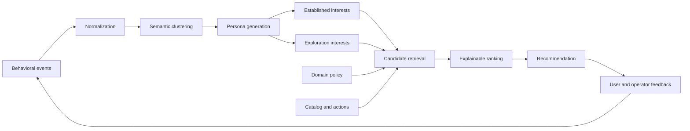

# Persona Recommendation Platform

## Problem

Most recommendation systems represent users as opaque IDs or vectors. That works for ranking, but it makes the system difficult to explain, govern, reuse across workflows, or correct when the inferred preferences are wrong.

This project introduces a semantic planning layer between behavioral data and ranking. It converts interaction histories into natural-language personas, separates established interests from adjacent exploration interests, and generates recommendations with evidence and explanations.

## Supported use cases

- Revenue next-best action and account expansion
- Commerce cold-start discovery and bundles
- Customer-success adoption, retention and expansion
- Learning pathways and skill journeys
- Wealth client education and advisor engagement
- Publisher content and subscription discovery
- Patient education, reminders and care navigation
- Generic marketplace and vertical-SaaS recommendations

## Architecture



## Core design choices

1. **Semantic personas:** user state is represented in natural language with confidence, freshness and evidence.
2. **Controlled exploration:** exploitation and exploration are independent signals that can be blended by domain policy.
3. **Shared platform, domain-specific policy:** the runtime is reusable while event weights, item types, safeguards and business outcomes vary by use case.
4. **Explainable ranking:** recommendations expose matched interests, ranking mode, reasons and business-priority contributions.
5. **Asynchronous persona lifecycle:** cached personas can be served immediately and refreshed outside the user request path.
6. **Deterministic fallback:** the system can operate without an LLM, while an optional reasoning model improves persona labels and adjacent-topic generation.
7. **Human correction:** feedback, dismissals and persona corrections become first-class inputs rather than afterthoughts.

## MVP implementation

- FastAPI service
- Versioned persona generation
- Semantic event clustering
- Multi-domain policy registry
- Candidate retrieval and ranking
- SQLite event, item, persona and feedback store
- Optional OpenAI Responses API provider
- Demo dashboard and revenue seed scenario
- Docker packaging
- Unit and API tests
- GitHub Actions CI

## Production evolution

```text
Event streams: Kafka or Kinesis
Persistent state: Postgres plus a feature store
Semantic retrieval: pgvector, OpenSearch or a vector database
Caching: Redis
Orchestration: Temporal, Celery or managed queues
Retrieval models: two-tower or sequential recommenders
Governance: consent, sensitive-trait policy, audit and human review
Evaluation: A/B tests, interleaving, counterfactual metrics, drift and diversity
```

## Evaluation framework

The platform should track:

- Persona accuracy and evidence coverage
- Staleness and repetitive-interest rates
- Unsupported or sensitive inference rate
- Recommendation relevance and acceptance
- Exploration exposure and conversion
- Diversity, novelty and long-term engagement
- Latency, cost and refresh frequency
- Business outcomes appropriate to each domain

## Responsible use

The healthcare and wealth configurations are engagement and education patterns, not diagnostic, treatment, investment or fiduciary decision systems. Production implementations require domain-specific compliance, consent, safety testing, access controls and human accountability.
