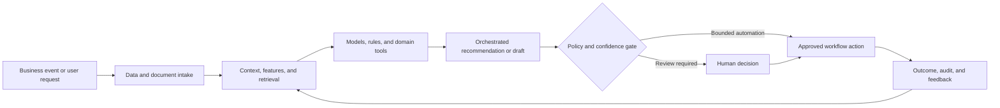

# Marketing Product Literature Generation AI

### Multimodal generative content pipeline from technical specifications to governed product literature

> **Portfolio context:** Implemented a generative AI pipeline that automated product content creation from technical specifications using document intelligence, large language models, and image generation.

This repository is a **public-safe solution architecture and implementation shell**. It documents the product design, data and AI architecture, evaluation approach, operating controls, and pilot path without exposing customer information, proprietary source code, confidential employer assets, or production credentials.

## Executive summary

Product launches require accurate, consistent, brand-compliant literature across brochures, web pages, catalogs, sales sheets, and channel content. Manual authoring creates long lead times and introduces inconsistency between technical source material and customer-facing claims.

The proposed system combines domain data, machine learning, retrieval, workflow orchestration, policy controls, and human judgment. The objective is not to automate every decision. The objective is to make the workflow faster, more consistent, evidence-based, measurable, and safe to operate.

## Target users

- Product marketing
- Product management
- Technical writers
- Brand and creative teams
- Regulatory, legal, and compliance reviewers
- Sales enablement teams

## Business outcomes

- Accelerate new-product content creation
- Maintain traceability from claims to technical sources
- Generate channel-specific variants from a shared content model
- Reduce manual authoring and review cycles
- Improve consistency across text, images, and product metadata

## End-to-end workflow

1. Ingest product specifications, drawings, tables, and approved assets
2. Extract structured attributes, claims, warnings, and evidence
3. Build a governed product content model
4. Generate audience and channel-specific copy
5. Create or select compliant visual assets
6. Run factual, brand, regulatory, and duplication checks
7. Route content through review and publishing workflows

## Reference architecture



## AI and engineering components

- Document intelligence and table extraction
- Product knowledge graph and content model
- RAG over approved technical sources
- LLM copy-generation and transformation agents
- Image generation or retrieval with asset governance
- Claim verification and policy checks
- Human review and content-management integration

## API shell

The repository includes a minimal FastAPI contract. It is intentionally thin and does not pretend to contain the confidential production implementation.

```bash
python -m venv .venv
source .venv/bin/activate
pip install -e '.[dev]'
uvicorn src.app:app --reload
pytest
```

Primary demonstration endpoint: `/v1/content/generate`

Example request:

```json
{
  "product_id": "PROD-881",
  "channels": [
    "web",
    "sales-sheet"
  ],
  "audience": "technical-buyer"
}
```

Example response contract:

```json
{
  "status": "drafts_generated",
  "review_required": true,
  "traceability": "claim_to_source"
}
```

## Evaluation framework

- Time from specification to approved content
- Factual accuracy and claim traceability
- Reviewer edit distance
- Brand and regulatory compliance
- Content reuse and channel coverage
- Engagement and conversion after publication

Evaluation must include technical quality, workflow quality, human outcomes, business outcomes, and safety. See [docs/EVALUATION.md](docs/EVALUATION.md).

## Repository structure

```text
.
├── README.md
├── pyproject.toml
├── data/
│   └── synthetic_case.json
├── docs/
│   ├── ARCHITECTURE.md
│   ├── EVALUATION.md
│   ├── GOVERNANCE.md
│   └── PILOT_PLAN.md
├── src/
│   └── app.py
└── tests/
    └── test_contract.py
```

## Production-readiness principles

- Use synthetic or properly authorized data during development.
- Enforce identity, role, tenant, and purpose-based access controls.
- Version data, models, prompts, rules, tools, and evaluation sets.
- Require evidence and traceability for consequential recommendations.
- Define where the system may act, where it must ask, and where it must abstain.
- Monitor drift, latency, cost, failure modes, overrides, and business outcomes.
- Preserve human accountability for high-impact decisions.

## Pilot approach

A controlled pilot for one product family and two channels with source-to-claim traceability and mandatory legal and brand review.

## Status

This is a portfolio-grade shell intended for solution discussion, architecture review, and rapid prototyping. The next implementation step is to connect synthetic data and one model or workflow component while preserving the documented evaluation and governance controls.
