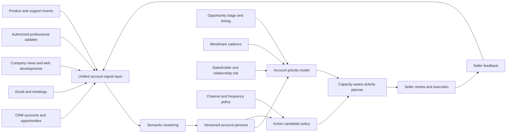

# Seller Activity Planner

## Product problem

B2B salespeople often work across CRM opportunities, email threads, meetings, company news, support issues, website intent and professional updates. Each system produces alerts, but none reliably answers:

1. Which customers deserve attention now?
2. What changed since the seller last looked?
3. What action should the seller take next?
4. How can the seller maintain mindshare without creating contact fatigue?

The Seller Activity Planner converts these fragmented signals into a prioritized, capacity-aware daily and weekly plan.

## Product experience

For each account, the seller sees:

- Account priority and opportunity urgency
- Days since the last meaningful interaction
- Current opportunity stage, close date and overdue next step
- New company, contact, product, support or engagement developments
- Missing stakeholders and relationship risks
- A semantic account persona
- Recommended action, channel and due time
- The objective and suggested message angle
- Evidence and source links
- Contact-frequency and data-use guardrails

## Architecture

## Account prioritization

For active opportunities, the illustrative model combines:

| Component | Weight |
|---|---:|
| Close and next-step urgency | 22% |
| Stage momentum and stall pressure | 14% |
| Deal value | 13% |
| Mindshare and cadence need | 16% |
| New event or engagement trigger | 15% |
| Relationship and deal risk | 10% |
| Stakeholder gap | 6% |
| Persona clarity and fit | 4% |

Accounts without an active opportunity shift toward strategic value, product fit, expansion potential, relationship cadence and external developments.

## Mindshare model

The planner compares the last meaningful interaction against a configurable target cadence. A negotiation-stage opportunity can require frequent contact, while a strategic account without an active opportunity may need a monthly value-led touch.

The platform can recommend outreach when the relationship is becoming stale, but it can also recommend waiting after a recent interaction. Fresh inbound activity, such as a proposal view or customer reply, can override the normal cadence gate.

## Recommended actions

Examples include:

- Follow up after proposal engagement
- Run a mutual close-plan review
- Create executive alignment
- Add missing stakeholders
- Address an emerging deal or account risk
- Use verified company news to open a useful conversation
- Congratulate a contact on a verified professional update
- Re-establish mindshare with a value-led check-in
- Open an expansion discovery conversation
- Prepare internally before external outreach
- Pause and monitor after a recent meaningful interaction

Each recommendation includes a business objective, message angle, evidence, source links, timing and human-review requirement.

## Capacity-aware planning

The planner does not return every possible task. It first selects the strongest action across priority accounts, limits repetitive activity for the same customer, and fits the plan to the seller's available capacity and planning horizon.

A production version could incorporate calendar availability, meeting preparation time, travel, territory routing and manager priorities.

## Data-source design

| Source | Example signals |
|---|---|
| Salesforce, HubSpot or Dynamics | stage change, forecast change, next step, proposal status |
| Gmail or Outlook | customer reply, objection, stakeholder introduction, unanswered thread |
| Calendar and meeting platforms | meeting completed, requested follow-up, agreed next step |
| News and web sources | earnings, funding, acquisition, expansion, leadership change |
| Authorized professional updates | promotion, new role, departure, new hire |
| Product telemetry | adoption, new team activity, dormant usage |
| Support systems | escalation, resolution, repeated issue |
| Website intent | return visit, pricing engagement, content interest |

Professional updates must come from an authorized integration, user-provided export or manually supplied signal. The product does not depend on scraping.

## Governance

- Sellers review and edit recommendations before execution
- Do-not-contact accounts cannot receive external actions
- Contact channel permissions are enforced
- Frequency controls suppress repetitive recommendations
- Material news and role changes should be verified before being referenced
- Sensitive personal characteristics are not inferred or used for targeting
- Recommendations expose the evidence and score drivers behind them
- Production deployments require role-based access, retention, audit and regional privacy controls

## MVP implementation

- FastAPI service
- Account, contact and opportunity APIs
- Shared signal-ingestion model
- Semantic account personas
- Account priority model
- Event-triggered and cadence-aware action ranking
- Capacity-aware activity plan
- Seller feedback and frequency controls
- Browser dashboard
- Synthetic enterprise sales scenarios
- Automated API, prioritization, governance and planning tests
- GitHub Actions CI

## Evaluation

The product should measure:

- Time saved in seller planning
- Recommendation acceptance and dismissal reasons
- Stale CRM next-step reduction
- Meeting and response conversion
- Opportunity stage velocity
- Stakeholder coverage
- Win rate and forecast accuracy
- Expansion pipeline created
- Repetitive-action and contact-fatigue rates

## What this project demonstrates

The Seller Activity Planner shows how a general recommendation platform can become an operating system for B2B seller attention. It combines account state, relationship memory, external developments, semantic reasoning, explicit policy and human judgment around the next best use of a seller's limited time.
